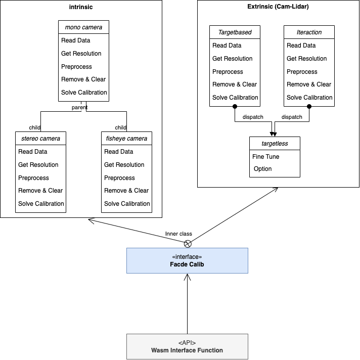

# Calib APP

Calib App support to acquire of extrinsic, intrinsic parameter between sensors.

## Overview
- [Calib APP](#calib-app)
  - [Overview](#overview)
  - [Done](#done)
  - [TODO List](#todo-list)
  - [Structure](#structure)
  - [Interface function API](#interface-function-api)
  - [Demo](#demo)
  - [Suggestions for Readings](#suggestions-for-readings)

## Done
* [X] support mono camera intrinsic algorithm
* [X] support mono camera intrinsic algorithm
* [X] support extrinsic parameter between lidar and camera by targetbased method
* [X] pcl, ceres, opencv, eigen wasm build

## TODO List
* [ ] fish eye camera algorithm on wasm
* [ ] build in superb3d
* [ ] interaction algorithm on wasm
* [ ] targetless algorithm on wasm
* [ ] Updata API on Notion

## Structure
[Facade Pattern](https://en.wikipedia.org/wiki/Facade_pattern)

## Interface function API

[Notion API Page](https://www.notion.so/superbai/Calibration-App-Interface-API-7ac1a38838074f399a3576f0b67d6675?pvs=4)

## Demo
[ver 0.1] (https://calib-59fc1lio4-ies0411.vercel.app/extrinsic_camlidar)

## Suggestions for Readings
[OpenCv Calibration](https://docs.opencv.org/4.x/dc/dbb/tutorial_py_calibration.html)

[Targetless calibration](https://arxiv.org/abs/2103.01627)

